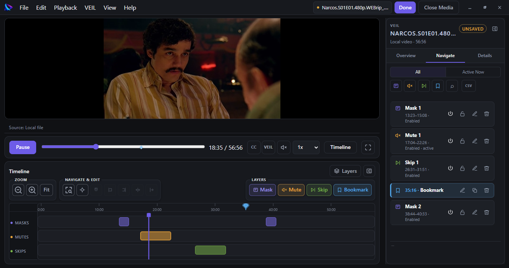

<p align="center">
  
</p>

# VEIL Player Desktop

**VEIL Player Desktop 0.8.0-RC2**

VEIL Player Desktop is a local-first Windows media player and an open-source, **non-normative Desktop implementation** of the [VEIL interoperability specification](https://github.com/allamzedan/veil). It applies separate `.veil` playback instructions without modifying the source media.

The canonical VEIL specification remains authoritative over implementation behavior. This repository contains application source, not normative VEIL material.

Sibling implementation: [VEIL Player Mobile](https://github.com/allamzedan/veil-player-mobile).

## Download

**Current release candidate:** [VEIL Player Desktop 0.8.0-RC2](https://github.com/allamzedan/veil-player/releases/tag/v0.8.0-rc.2)

Available for Windows as:

- **Installer** — standard Windows installation.
- **Portable** — run VEIL Player without installation.

<p align="center">
  
</p>

## Conformance status

The current source was validated against **VEIL Spec 0.1 — Experimental**. VEIL Player Desktop conforms to VEIL Spec 0.1 for its claimed capability scope based on the final validation evidence: 113/113 frozen corpus vectors passed, with zero failures or untestable results, and the direct coverage-gap tests passed.

Claimed capabilities:

- Reader
- Writer
- Playback
- Local Media Identity
- Canonical Validation
- Provider Integration
- Resource Safety

This is a project conformance statement, not certification, standards-body approval, or a claim of universal compatibility.

## Features and files

- Windows local video and audio playback
- Mask, Mute, Skip, and Bookmark timeline items
- Subtitle import and presentation controls
- Explicit load and save of `.veil` files; legacy `.veil.json` and `.json` names also load
- Optional YouTube/provider integration

Original media files are never modified. VEIL files contain instructions and metadata, not media.

## Requirements

- Windows 10 or later for the supported Desktop target
- Node.js 22 or later; validation was performed with Node.js 24.14.1
- npm 10 or later; validation was performed with npm 11.12.1
- Network access during dependency installation and packaging so npm, Electron, and electron-builder can obtain locked packages/tooling

## Development and validation

```powershell
npm ci
npm run dev
npm run typecheck
npm test
npm run qa
npm run build
```

`npm run build` creates the application source bundle in `out/`. It does not create a distributable installer.

To produce Windows installer and portable artifacts locally:

```powershell
npm run dist
```

Packaging may download Electron/electron-builder support archives. Generated packages belong in release artifacts, not source history. Official binaries are distributed through [GitHub Releases](https://github.com/allamzedan/veil-player/releases) with the applicable third-party notices. Official binary releases are built only from a reviewed dependency state and receive artifact-level security and license validation before distribution.

## Optional YouTube provider

The source includes optional YouTube provider integration. Provider-disabled production builds are the default, and the 0.8.0-RC2 distribution does not enable the provider.

Provider-enabled builds are intended for development/testing and remain subject to applicable YouTube policies and separate provider-compliance requirements. VEIL itself is provider-independent.

See the privacy policy and provider documentation for details.

## Security and privacy

VEIL is local-first and contains no analytics SDK or media-upload service. Imported `.veil` data is treated as untrusted: malformed known data, duplicate JSON members, and resource-limit violations are rejected before runtime actions execute. Unknown supported-forward data remains inert.

Do not commit API keys, personal media, generated packages, logs, or local environment files.

## Documentation

- [Architecture](docs/ARCHITECTURE.md)
- [Track format](docs/track-format.md)
- [Keyboard shortcuts](docs/shortcuts.md)
- [Subtitle workflows](docs/subtitle-workflows.md)
- [Troubleshooting](docs/troubleshooting.md)
- [Known limitations](docs/known-limitations.md)
- [Changelog](CHANGELOG.md)

## Licensing

Copyright 2026 Allam Zedan

Public contact: [allamzedan@live.com](mailto:allamzedan@live.com)

VEIL Player Desktop source is licensed under the [Apache License 2.0](LICENSE).

The VEIL interoperability specification is licensed separately in the canonical [allamzedan/veil](https://github.com/allamzedan/veil) repository. Any OWFa patent assurance associated with the VEIL specification is separate from, and is not, the Apache License 2.0 copyright license for VEIL Player Desktop source. Third-party dependencies and packaged runtime components retain their respective licenses; see [THIRD_PARTY_NOTICES.md](THIRD_PARTY_NOTICES.md). Apache License 2.0 applies to this Desktop source and does not imply affiliation with the Apache Software Foundation.
